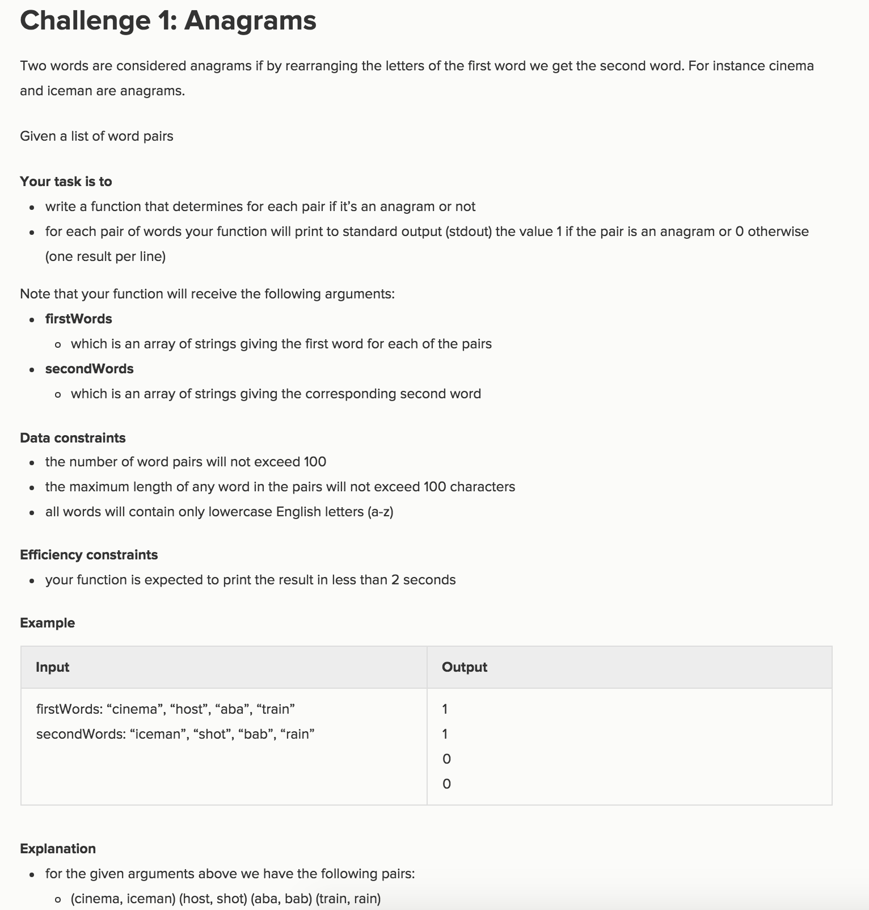

# Solution
```python
def anagrams(firswords, secondwords):
    for index in range(len(firswords)):
        if str(sorted(firswords[index])) == str(sorted(secondwords[index])):
            print(1)
        else:
            print(0)

print anagrams(['cinema','host','aba','train'] ,  ['iceman','shot','bab' ,'rain'])
# 1 1 0 0
```
